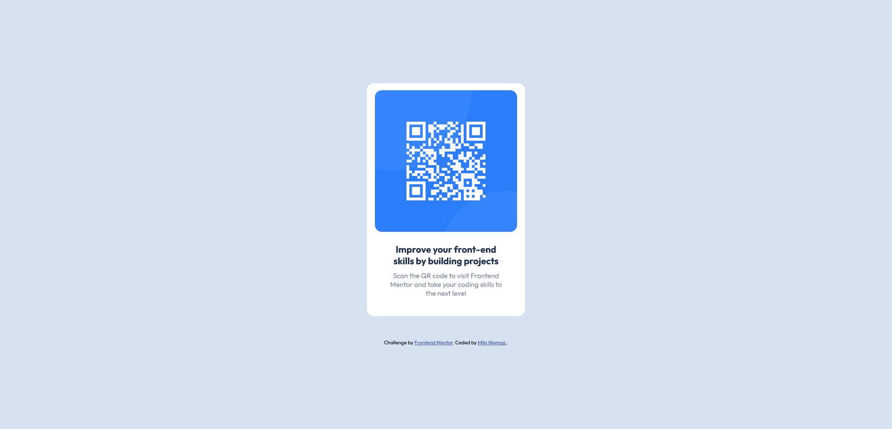

# Frontend Mentor - QR code component solution

This is a solution to the [QR code component challenge on Frontend Mentor](https://www.frontendmentor.io/challenges/qr-code-component-iux_sIO_H). Frontend Mentor challenges help you improve your coding skills by building realistic projects. 

## Table of contents

- [Overview](#overview)
  - [Screenshot](#screenshot)
  - [Links](#links)
- [My process](#my-process)
  - [Built with](#built-with)
  - [What I learned](#what-i-learned)
- [Author](#author)


## Overview

### Screenshot



### Links

- Solution URL: [My solution](https://polec4t.github.io/challenge-1-qr_code/)

## My process

### Built with

- Semantic HTML5 markup
- CSS custom properties
- Flexbox

### What I learned


```css
/* in order to put elements of the body in the center (vertically),
 I used "justify-content: center;", but I needed to put "height:
 100vh;" in order to make justify-content functional */
body {
    display: flex;
    flex-direction: column;
    justify-content: center;
    
    height: 100vh;
    background-color: var(--grisclair);
}
```

## Author

- Frontend Mentor - [@POLEC4T](https://www.frontendmentor.io/profile/POLEC4T)


